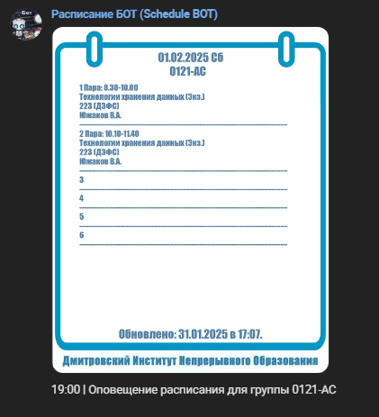

# ВК-бот по рассылке расписания

### Это мой проект ВК-бота, рассылающего расписание университета, в котором я обучался.

### Пример использования

#### Команда `инфо`.


#### Оповещение расписания.



#### Кнопка `Недельное расписание`.


### Build & Deploy

Сборка осуществляется через **Docker**.

Сборка **Docker-образа**.

```bash
docker build -t python-rasp-bot .
```

Запуск **Docker-контейнера**.

```bash
docker run --name <name> \
           --env-file <.env file> \
           --restart=always \
           -v ./assets:/app/assets \
           -d python-rasp-bot
```

### Возможности

1. Команды через префиксы **(инфо, расп, нрасп, орасп)**.

2. Команды через ВК-кнопки.

3. Подключение к оповещению в **7:00** и **19:00** по МСК

4. Расписание в удобных картинках

5. Работа как в ЛС, так и в групповых чатах.
